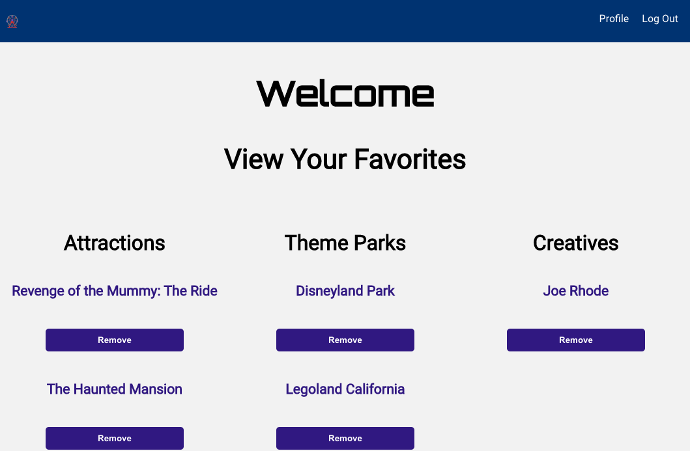

# TPDB FrontEnd

### Welcome to the Theme Park Database
Here on this site you will be able browse through our expansive database of Theme Parks, Attractions, and Creatives that have built these experiences.

___

### About This Project
For my final project with General Assembly, I wanted to do something that I would actually use and be passionate about building. As a huge Theme Park fan, I got the inspiration for this project while listening to a podcast where they joked about making an IMDB for Theme Parks. 

___

### Screenshots

___

### User Stories

* Users can navigate through all logged Theme Parks, Attractions, and Creatives in the database
* Users can see the connections through all three models and follow through to see more information
* If a user likes a Theme Park, Attraction, or Creative, they can add it to their favorites page
* A user can see all of their favorites on their profile page and remove favorites as they desire.
* An Admin has access to the Admin Dashboard, which displays site information and allows Admin to log new entries.

___

### Wireframes

___

### Technologies Used

Postgres, Sequelize, Express.js, React.js, Nodemon, HTML, CSS, Sass

___

### Special Thanks
I would like our instructors at General Assembly for their guidance along the way. This includes Brock Whitbread-Cole, James Sinkler, Seanny Phoenix, Jacob Kleiman, Uyen Lam, Michael Petty, among others. Additionally, I couldn't have done it without the "Party Bus" - (in no particular order) Jane Cho, Casey Jenkins, Lauren Nguyen, Jamie Cabrigas, Brock Molmen, Ashley Nguyen, and Kelsey Whallon.

 And lastly, thank you to all the theme parks and their creators for making such wonderful experiences.

___

### Future Development

1. Admin Abilities to Edit Posts
1. Search Function
1. Allow Users to Post to a Theme Park, Attraction, or Creative with photos
1. Discussion Boards/Edit Submissions

___

> Note: Built to work with [this repo](https://github.com/lucyefranco/TPDB-backend).
